# 🌱 AgriSense - AI Powered Crop Recommendation & Market Intelligence Platform

<!-- <div align="center">

### Smart Farming Through AI, Weather Intelligence & Market Forecasting


</div> -->

---

# 📖 Overview

AgriSense is a Full-Stack AI-powered agricultural decision support platform designed to help farmers make data-driven cultivation decisions.

The platform combines:

* 🌾 Crop Recommendation
* 📈 Market Price Prediction
* 🌦️ Weather Advisory
* 📚 Crop Library
* 📄 AI Insight Report Generation
* 👨‍💼 Admin Analytics Dashboard
* 🤖 Machine Learning Models

to recommend profitable and suitable crops based on environmental, soil, seasonal, and market conditions.

---

# 🎯 Problem Statement

Farmers often face challenges such as:

* Selecting suitable crops
* Understanding soil requirements
* Analyzing weather conditions
* Predicting market prices
* Estimating profitability
* Accessing reliable agricultural information

AgriSense addresses these challenges through AI-driven recommendations and market intelligence.

---

# ✨ Features

# 👨‍🌾 User Features

## 🔐 Authentication System

* User Registration
* User Login
* JWT Authentication
* Forgot Password
* Reset Password via Email
* Protected Routes

---

## 👤 Profile Management

* View Profile
* Update Profile
* Upload Profile Image
* Account Management

---

## 🌾 Crop Recommendation System

AgriSense supports two recommendation modes.

### Quick Recommendation Mode

#### Inputs

* State
* District
* Season

#### Process

* Fetches district-level soil information
* Retrieves weather information
* Applies ML recommendation model
* Returns ranked crop suggestions

#### Output

* Recommended Crops
* Suitability Ranking
* AI Insights

---

### Soil-Based Recommendation Mode

#### Inputs

* State
* District
* Season
* Nitrogen (N)
* Phosphorus (P)
* Potassium (K)
* pH

#### Process

* Uses actual soil parameters
* Combines weather intelligence
* Applies ML model
* Generates personalized recommendations

#### Output

* Recommended Crops
* Crop Ranking
* Suitability Analysis

---

# 🔔 Notification & Communication System

AgriSense includes a two-way communication system between users and administrators.

## User Features

Users can:

* Submit feedback
* Suggest new features
* Report issues
* Ask farming-related queries
* Track admin responses

## Admin Features

Administrators can:

* View all user feedback
* Reply to user queries
* Manage suggestions and reports
* Update feedback status

## Real-Time Notification Experience

When an admin replies:

1. The reply is stored in the database.
2. A notification is generated for the user.
3. The user can view the notification from the notification bell.
4. Users can read admin responses directly inside the platform.

This enables seamless communication between platform administrators and farmers.


# 🌦️ Weather Advisory System

Provides weather intelligence for better farming decisions.

### Weather Parameters

* Temperature
* Humidity
* Rainfall
* Weather Conditions

### Benefits

* Better crop planning
* Irrigation guidance
* Weather-aware recommendations

---

# 📚 Crop Library

Provides detailed information about supported crops.

### Information Available

* Crop Image
* Crop Description
* Growing Season
* Soil Requirements
* Water Requirements
* Crop Category
* Cultivation Insights

### Supported Crops

* Rice
* Wheat
* Maize
* Bajra
* Jowar
* Barley
* Chickpea
* Lentil
* Pigeonpea
* Groundnut
* Soybean
* Mustard
* Sesame
* Cotton
* Sugarcane
* Banana
* Mango
* Papaya
* Coconut
* Orange
* Grapes
* Potato
* Onion
* Tomato
* Ginger
* Urad
* Ragi
* Jute
* Sunflower

---

# 📈 Market Price Prediction

Predicts future market prices using machine learning.

### Inputs

* Crop
* State
* District
* Month

### Process

* Historical market data analysis
* Feature engineering
* XGBoost forecasting
* Price prediction

### Output

* Predicted Market Price
* State-specific forecast
* District-specific forecast

---

# 📄 AI Insight Report

Generates a detailed AI-powered farming report.

### Includes

#### Crop Analysis

* Recommended Crop
* Suitability Score
* Crop Ranking

#### Soil Analysis

* NPK Analysis
* Soil Health Insights
* pH Evaluation

#### Weather Analysis

* Temperature Assessment
* Rainfall Analysis
* Humidity Evaluation

#### Market Analysis

* Price Forecast
* Market Outlook

#### Recommendations

* Farming Suggestions
* Risk Factors
* Best Practices

### Export Options

* Download PDF Report

---

# 📊 Prediction History

Users can:

* Save Recommendations
* Save Price Predictions
* View Historical Records
* Track Previous Analyses

---

# 💬 Feedback System

Users can:

* Submit Feedback
* Report Issues
* Suggest Improvements

---

# 👨‍💼 Admin Features

## 📊 Admin Dashboard

Provides platform-wide analytics.

### Dashboard Metrics

* Total Users
* Total Recommendations
* Total Price Predictions
* User Activity Statistics
* Platform Usage Metrics

---

# 🌙 Dark Mode Support

AgriSense provides a modern dark mode experience across the platform.

### Supported Pages

* Dashboard
* Profile
* Crop Recommendation
* Crop Library
* Prediction History
* Feedback System
* Admin Dashboard
* User Management
* Analytics
* Crop Management

### Benefits

* Improved readability
* Reduced eye strain
* Better accessibility
* Modern user experience

Theme preference is preserved across sessions for a consistent experience.


## 👥 User Management

Admin can:

* View All Users
* Monitor User Activity
* Manage User Records

---

 

## 📈 Platform Monitoring

Admin can monitor:

* Recommendation Requests
* Prediction Requests
* User Engagement

---

# 🤖 Machine Learning Modules

## Crop Recommendation Model

### Features Used

* Nitrogen (N)
* Phosphorus (P)
* Potassium (K)
* Temperature
* Humidity
* Rainfall
* pH

### Models Evaluated

* Decision Tree Classifier
* Random Forest Classifier
* XGBoost Classifier

### Final Model

**Random Forest Classifier**

### Performance

| Metric            | Value |
| ----------------- | ----- |
| Training Accuracy | 100%  |
| Test Accuracy     | ~97%  |

---

## Market Price Prediction Model

### Features

* Crop
* State
* District
* Month

### Algorithm

**XGBoost Regressor**

### Purpose

Forecast future market prices of agricultural commodities.

---

# 🏗️ System Architecture

```text
User
 │
 ▼
React Frontend (Vite + Tailwind CSS)
 │
 ▼
Node.js + Express Backend
 │
 ├── MongoDB Atlas
 │
 └── FastAPI ML Service
          │
          ├── Crop Recommendation Model
          │
          ├── Market Price Prediction Model
          │
          └── AI Insight Engine
```

---

# ⚙️ Tech Stack

## Frontend

* React.js
* Vite
* Tailwind CSS
* React Router
* Axios
* Recharts
* React Hot Toast
* Lucide React

---

## Backend

* Node.js
* Express.js
* JWT Authentication
* Multer
* Nodemailer
* Axios

---

## Machine Learning

* Python
* FastAPI
* Scikit-Learn
* XGBoost
* Pandas
* NumPy
* Joblib

---

## Database

* MongoDB Atlas
* Mongoose

---

## Deployment

* Render Frontend
* Render Backend
* Render ML Service

---

# 🔒 Security Features

* JWT Authentication
* Password Hashing (bcrypt)
* Protected Routes
* Authorization Middleware
* Role-Based Access Control (RBAC)

---

# 📂 Project Structure

```text
Agrisense
│
├── client
│   ├── src
│   ├── components
│   ├── pages
│   ├── context
│   ├── routes
│   └── api
│
├── server
│   ├── controllers
│   ├── routes
│   ├── middleware
│   ├── models
│   ├── config
│   └── services
│
├── ml-service
│   ├── app
│   ├── services
│   ├── models
│   ├── datasets
│   └── schemas
│
└── README.md
```

---

# 🚀 Future Enhancements

* Cloudinary Integration
* AI Chat Assistant
* Fertilizer Recommendation Engine
* Disease Detection using Deep Learning
* Real-Time Weather Alerts
* Government Scheme Recommendations
* Mobile Application
* Advanced Profit Analytics
* Voice-Based Farmer Assistant
* Multilingual Support

---

# 🎓 Learning Outcomes

This project demonstrates:

* Full Stack Development
* Machine Learning Integration
* FastAPI Development
* REST API Design
* Authentication & Authorization
* Cloud Deployment
* MongoDB Integration
* Production Architecture
* Agricultural Intelligence Systems

---

# 📸 Application Screenshots


## Landing Page

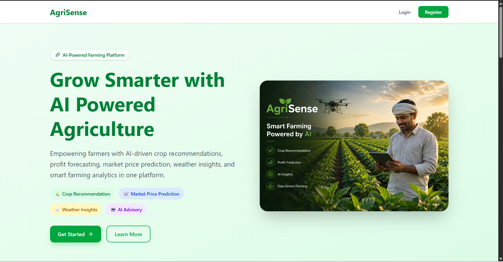

## Dashboard

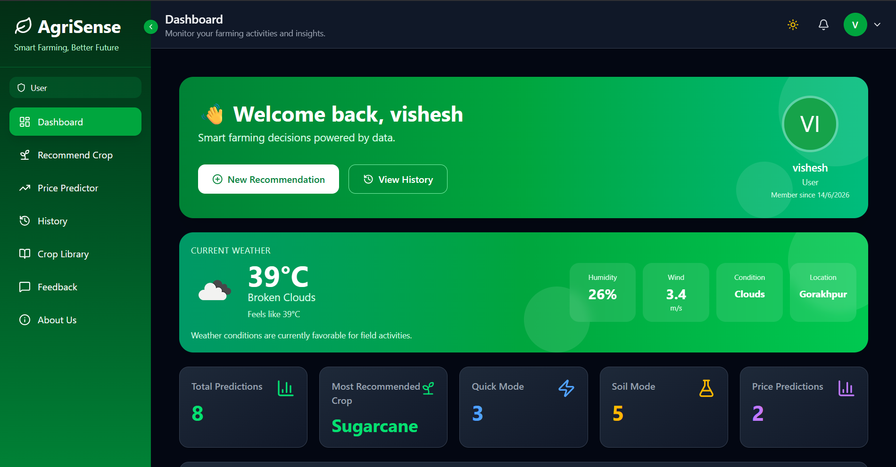

## Crop Recommendation

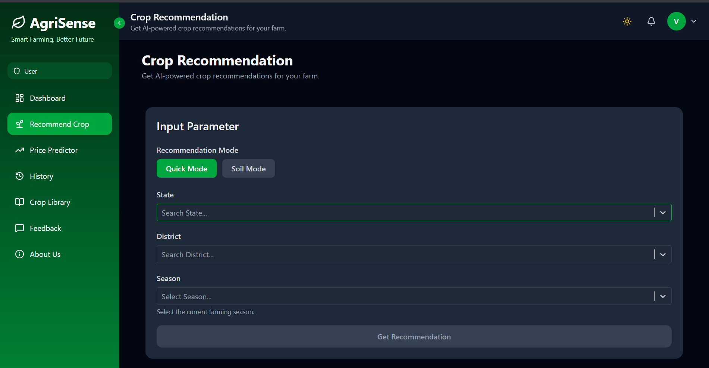

## Recommendation Output

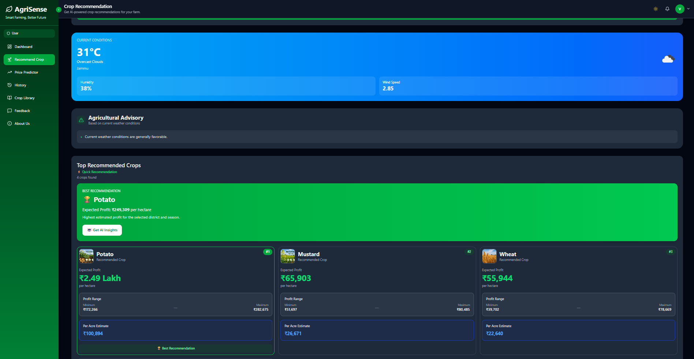

## Market Price Predictor

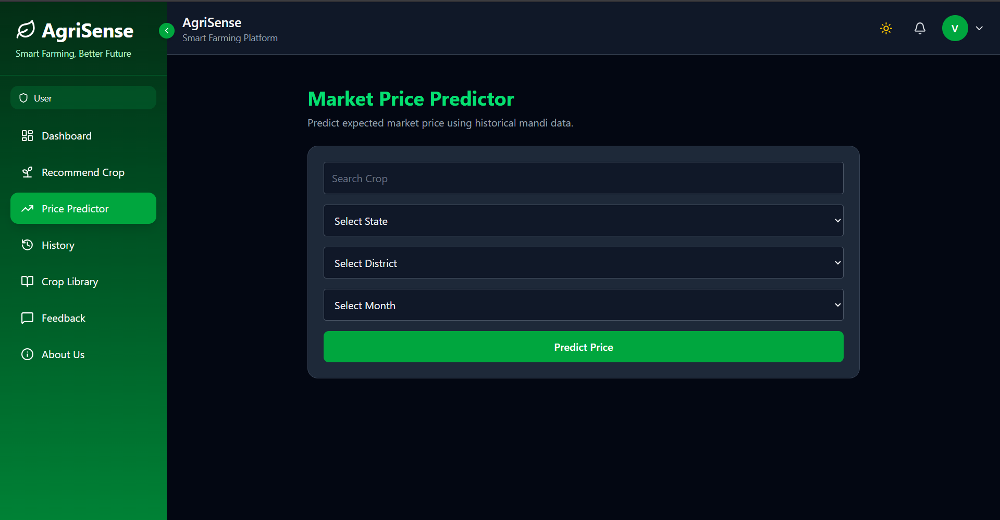

## AI Insight Report

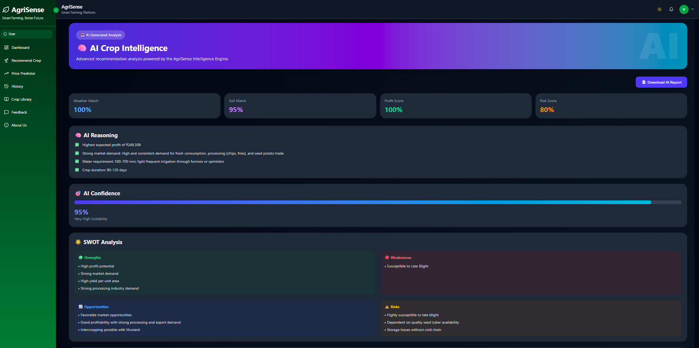

## History Page

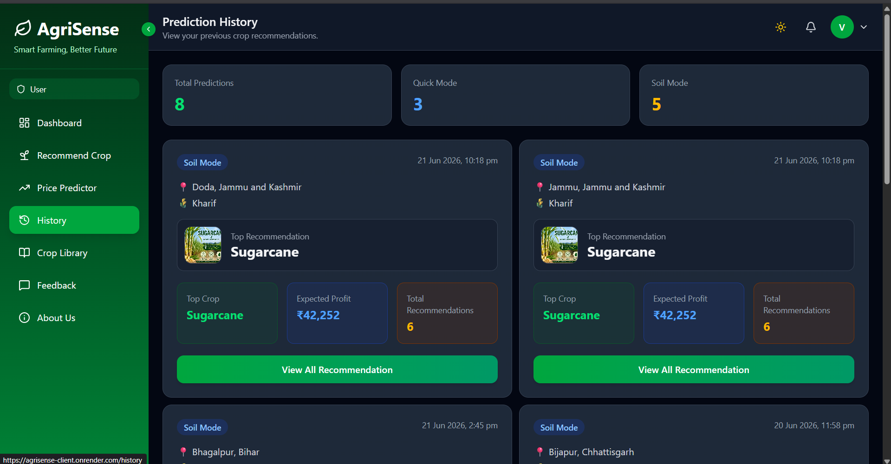

## Crop Libraray

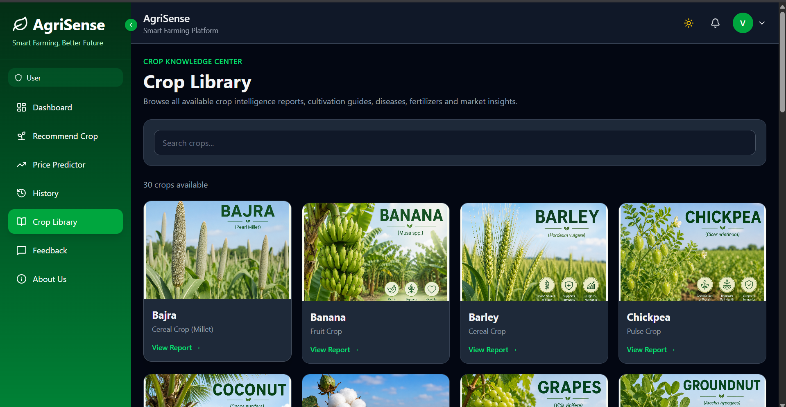

## User Feedback

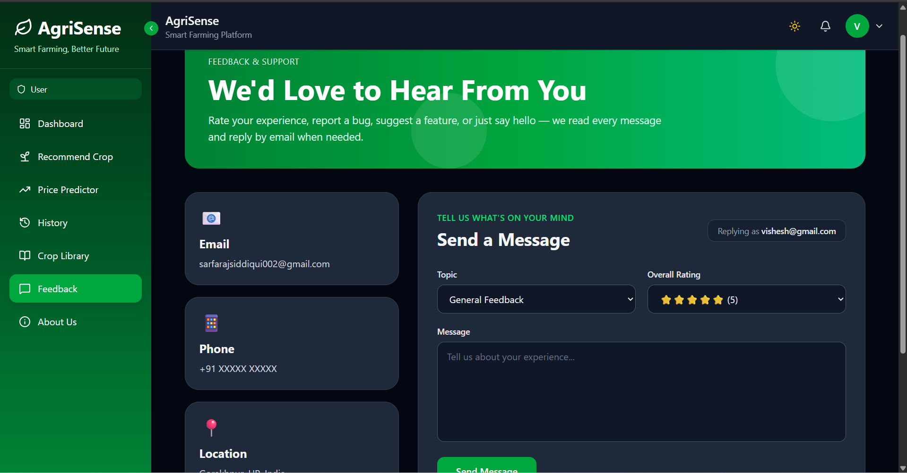

## Admin Dashboard

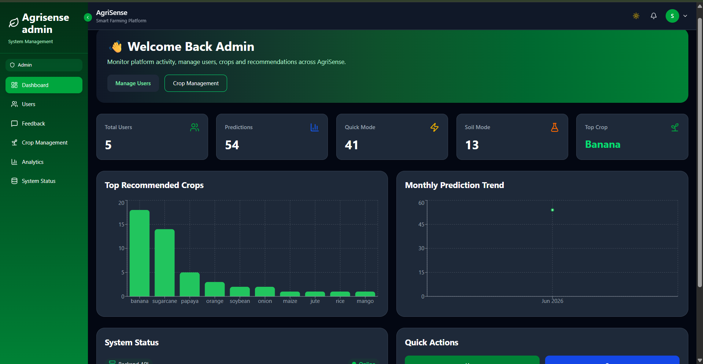

## Admin User Management

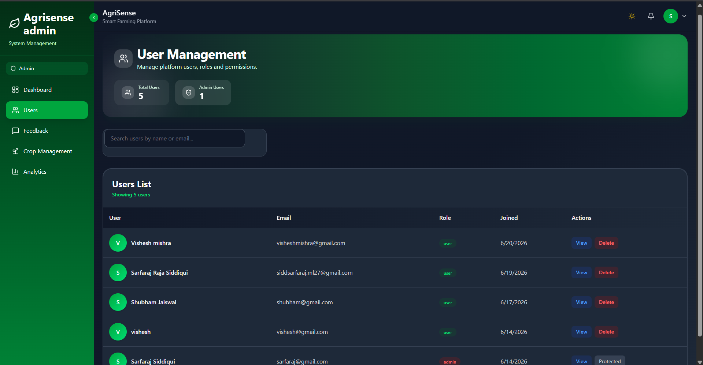

## Admin Analytics Dashboard

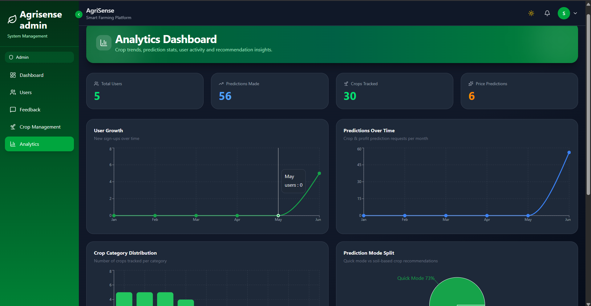

## Admin Crop Management

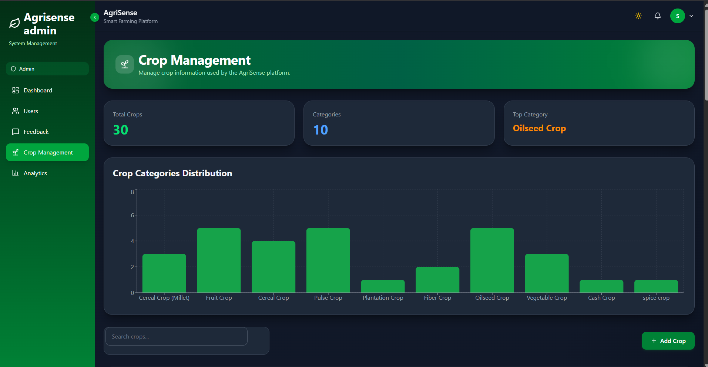

## Admin Add Crop

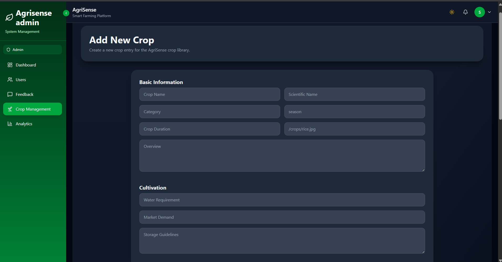

## Admin Feedback Management

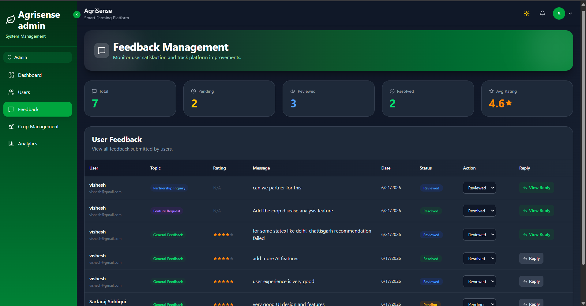


# 👨‍💻 Author

### Sarfaraj Siddiqui

B.Tech CSE (2023-2027)
Madan Mohan Malaviya University of Technology (MMMUT)

### Connect With Me

* GitHub: https://github.com/ItzSarfaraj
 

---

⭐ If you found this project useful, consider giving it a star.
